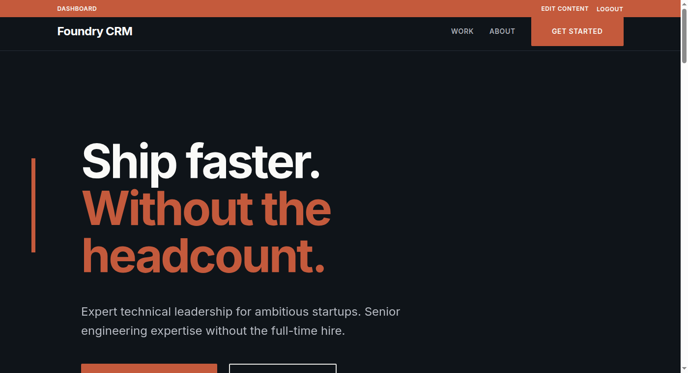
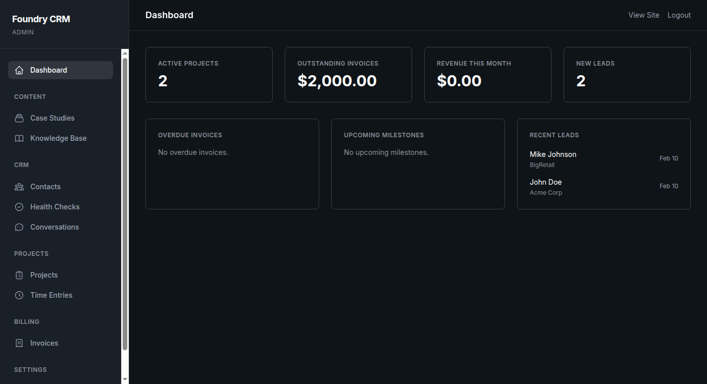
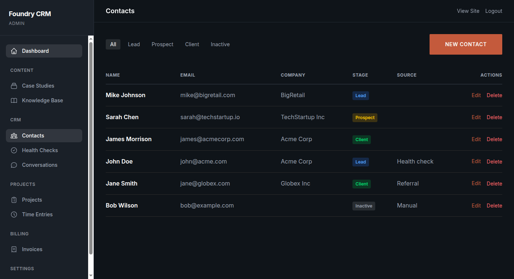
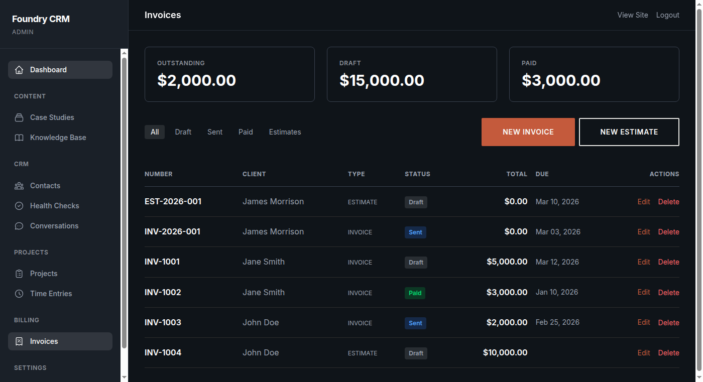
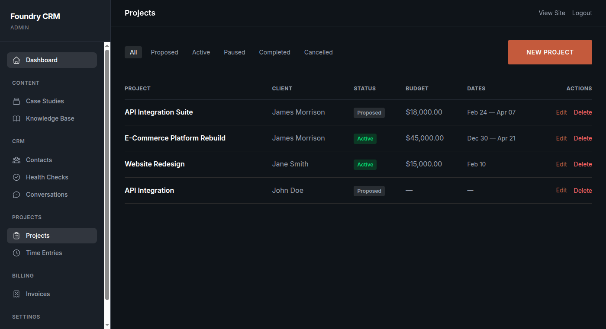
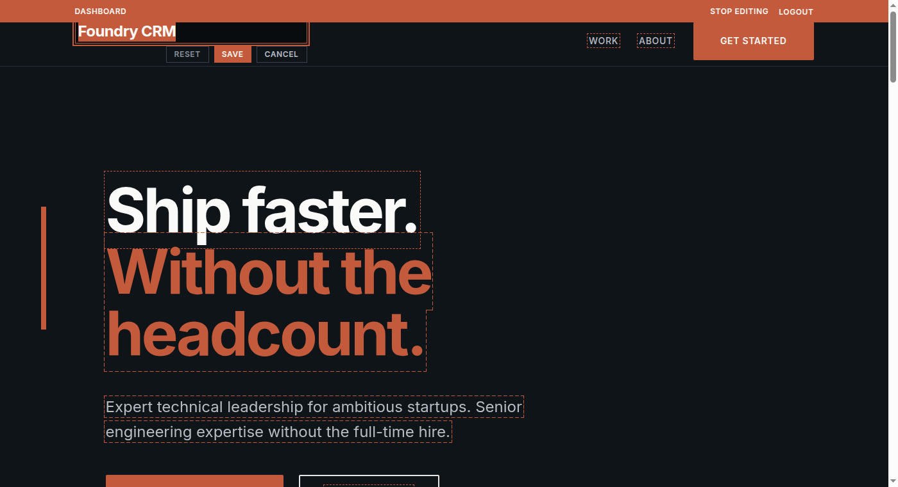

# Foundry CRM

A lightweight CRM built with Ruby on Rails for solo consultants and small agencies.

## Features

- **Contact Management**: Track leads, prospects, and clients through pipeline stages
- **Projects & Milestones**: Manage engagements with status tracking and milestone completion
- **Invoicing with PDF**: Create invoices and estimates with line items, auto-numbering, and PDF export
- **Time Tracking**: Log billable hours against projects, link entries to invoices
- **Health Check Intake**: Public intake form with email notifications
- **AI Chat Widget**: RAG-powered chat with knowledge document management
- **Admin Dashboard**: Full back-office with pagination and filtering
- **Case Studies**: Portfolio showcase with FriendlyId slugs

## Tech Stack

| Layer | Technology |
|---|---|
| Framework | Rails 8.1 |
| Database | PostgreSQL + pgvector |
| Frontend | Hotwire (Turbo + Stimulus), Tailwind CSS 4 |
| Background Jobs | Solid Queue |
| Caching | Solid Cache |
| WebSockets | Solid Cable |
| Deployment | Kamal |
| Testing | Minitest |
| Secrets | Bitwarden Secrets Manager (BWS) |

## Screenshots



<table>
  <tr>
    <td><strong>Admin Dashboard</strong><br></td>
    <td><strong>Contacts</strong><br></td>
  </tr>
  <tr>
    <td><strong>Invoices</strong><br></td>
    <td><strong>Projects</strong><br></td>
  </tr>
  <tr>
    <td><strong>Inline Edit Mode</strong><br></td>
    <td><strong>Inline Editing Active</strong><br></td>
  </tr>
</table>

## Managed Hosting

Don't want to self-host? Foundry CRM is available as a fully managed service — deployed, maintained, and backed up.

[Request managed hosting →](https://exampleurl.com/health_checks/new)

## Quick Start (Devcontainer)

The fastest way to get started. Requires [VS Code](https://code.visualstudio.com/) and [Docker](https://www.docker.com/).

1. Clone the repo
2. Open in VS Code, which will prompt to reopen in the devcontainer
3. The `postCreateCommand` runs `bin/setup` automatically

Once inside the devcontainer:

```bash
bin/dev              # Start server at http://localhost:3000
bin/rails test       # Run tests
bin/rails console    # Rails console
```

### Running Commands from the Host

```bash
docker exec -u vscode -w /workspaces/foundry-crm \
  foundry_crm-rails-app-1 bash -ic "rails test"
```

## Manual Setup

Requirements: Ruby (see `.ruby-version`), PostgreSQL 16+ with pgvector, Node.js (optional, for Tailwind watcher)

```bash
git clone https://github.com/your-org/foundry-crm.git
cd foundry-crm
bundle install
bin/rails db:setup    # Creates DB, runs migrations, seeds demo data
bin/dev               # Starts Rails + Tailwind watcher
```

## Login

There is no public-facing login link. To access the admin panel:

1. **Triple-click** the copyright text in the footer to reveal the login page (`/login`)
2. Sign in with your email and password

The default seed credentials are `admin@example.com` / `changeme123`. Create additional users via the Rails console:

```ruby
User.create!(email: "you@example.com", password: "your-password", password_confirmation: "your-password")
```

Once logged in, the admin dashboard is available at `/admin`.

## Seeds

`bin/rails db:seed` creates:

- **Admin user**: `admin@example.com` / `changeme123`
- Default site settings

## Deployment

Deployed via [Kamal](https://kamal-deploy.org) to any VPS.

```bash
kamal deploy       # Full deploy
kamal logs         # Tail logs
kamal console      # Remote Rails console
```

Configuration is in `config/deploy.yml`. Secrets are fetched from BWS at deploy time.

### BWS Secrets Management

This project uses [Bitwarden Secrets Manager](https://bitwarden.com/products/secrets-manager/) (BWS) to manage environment variables. The `.devcontainer/setup-bws-env.sh` script:

1. Reads secrets with the `FOUNDRY_CRM_` prefix from BWS
2. Maps them to standard env vars (e.g., `FOUNDRY_CRM_RAILS_MASTER_KEY` → `RAILS_MASTER_KEY`)
3. Sources them into the shell session

#### Setup

`BWS_ACCESS_TOKEN` must be configured in two places:

1. **Local environment**: `export BWS_ACCESS_TOKEN=<your-token>` before opening the devcontainer
2. **GitHub Actions**: Add `BWS_ACCESS_TOKEN` in repo Settings > Secrets and variables > Actions

## Environment Variables

| Variable | Purpose | Required |
|---|---|---|
| `RAILS_MASTER_KEY` | Decrypts credentials | Production |
| `HONEYBADGER_API_KEY` | Error monitoring | Production |
| `BREVO_SMTP_KEY` | Transactional email | Production |
| `OPENAI_API_KEY` | AI chat widget | Optional |
| `POSTGRES_PASSWORD` | Database password | Production |
| `DATABASE_URL` | Database connection | CI/Production |

## CI/CD

GitHub Actions pipelines:

- **CI** (`ci.yml`): Security scan (Brakeman, bundler-audit, importmap audit), RuboCop linting, test suite, system tests. Auto-fixes RuboCop violations on PRs using Claude Code.
- **CD** (`cd.yml`): Triggered on successful CI on `main`. Builds Docker image, deploys via Kamal, sends email notifications.
- **Kamal** (`kamal.yml`): Manual workflow dispatch for running Kamal commands.
- **Claude Code** (`claude.yml`): Responds to `@claude` mentions in issues and PRs.
- **Code Review** (`claude-code-review.yml`): Automated code review on PRs using Claude Code.
- **Dependabot**: Daily checks for gem and GitHub Actions updates.

## Pre-commit Hooks

Enable automated checks on commit:

```bash
git config core.hooksPath .githooks
```

Runs RuboCop and the full test suite before each commit. Skips for documentation-only changes.

## License

Elastic License 2.0. See [LICENSE](LICENSE) for details.

## Contributing

1. Fork the repo
2. Create your feature branch (`git checkout -b feature/my-feature`)
3. Commit your changes (`git commit -m "Add my feature"`)
4. Push to the branch (`git push origin feature/my-feature`)
5. Open a Pull Request

Please ensure all tests pass and RuboCop is clean before submitting.
